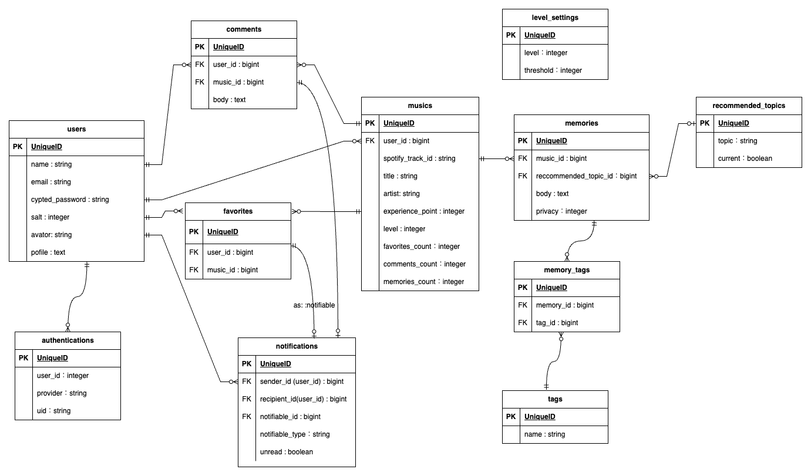

# サービス名: [STAY with MU（ステイウィズミュー）](https://www.stay-with-mu.com/)

## ■サービス概要

好きな音楽への想いを書き込むことで「曲を育てる」サービスです。
音楽愛を書き込むほど、MU（ミュー）のレベルが上がり、曲への想いも育つはず！

## ■ このサービスへの思い・作りたい理由

私は、音楽を聴くこと、ライブへ行くこと、歌うことが好きです。

ただ、寂しい気持ちになることがあります。それは、大好きな曲との思い出を忘れてしまうこと、誰かに好きな音楽の好きなところを語りたいのに言葉にできないことです。

そうならないように、音楽との忘れたくない大切な瞬間や、語りたい推しポイントがあった時はメモに残すようにしている時期もあったのですが、続きませんでした。なぜならめんどくさいから。そこで、音楽への思いを記録したりシェアすること自体にモチベーションを与えられるサービスを作りたいと思い、「曲を育てる」という発想に至りました。

「STAY with MU」は、音楽を「MU」と呼び、音楽愛を記録することでより曲への愛着を育み、相棒のような存在になれたらいいなという思いを込めて名付けました。

## ■ ユーザー層について
誰でも気軽に利用できるように裾野を広げていますが、好きな音楽との思い出を記録したり、好きな音楽を語りたい音楽好きの人をコアターゲットに考えております。

## ■サービスの利用イメージ

|トップ画面| ログイン画面|
|:-:|:-:|
|||
|使い方の説明は極小化し、おすすめの使い方で利用シーンをイメージしてもらうことを優先しました。|EmailとGoogleによるログインを実装しました。Googleで初期ログインした場合にはマイページ編集画面に遷移させ、ユーザー名の変更を促します。|

|みんなのMU| MU作成 |
|:-:|:-:|
|||
|MUの一覧を見られます。それぞれのMUには最新のメモリーの一部とタグが表示されます。検索機能ではオートコンプリートで曲名とアーティスト名の自動補完を行います。|MUの作成は検索結果から選択するのみでできます。オートコンプリートで|

|MU詳細（メモリー追加）|MU詳細（コメント追加）|
|:-:|:-:|
|||
|MU詳細画面ではメモリーの追加ができます。メモリーは非公開にできます。|他のユーザーのMUにコメントをすることができます。|

|マイページ（ユーザーページ）|ページネーション制限|
|:-:|:-:|
|||
|マイページ（ユーザーページ）ではつくったMUといいねしたMUを見ることができます。|短時間に大量のSpotifyの埋め込みを表示するとレートリミットに達してしまうため、制限するために5秒以内に連続してボタンを押せないようにしています。|

|通知機能|レスポンシブ対応|
|:-:|:-:|
|||
|アプリ内通知で、自分のMUにいいねされた時、自分のMUにコメントされた時、自分がコメントした先のMUにコメントされた時に通知が来るようにしました。|スマホからの利用を想定し、画面が小さい場合は固定フッターにして親指での操作が楽になるようにしました。|

## ■ サービスの差別化ポイント・推しポイント

音楽の感想を共有するサービスはすでに多く存在(代表例: [Chooning](https://chooning.app/ja), [HOWLUS](https://www.howlus.com/))してしていますが、以下の点で差別化しております。

- **追加した文章の量に応じて曲のレベルが上がる**

    作りたいと思った理由に繋がりますが、「音楽愛を発信したい」、「思い出を記録したい」といった純粋な気持ちをモチベーションとするサービスがほとんどですが、それだけだとユーザーの投稿するモチベーションが続かないのではないかと考えました。

    そこで、MUのレベルアップという他のユーザーを意識して投稿したくなるような、あえて不純な動機を与えることを意識しました。

- **文章の追加を随時行えるため投稿のハードルが低い。**

    上記のサービスは1曲に対して1つの文章という形式のため、「読んでもらえる整った文章を考えなければ」という心理がユーザーに働き、投稿のハードルが上がると考えました。

    そこで、「思いついたタイミングで」、「全く文脈を気にせず」、「好きなタグをつけて」随時文章の追加を行える形式にすることで、投稿のハードルを下げます。

## ■技術構成
| カテゴリ | 技術 |
| --- | --- |
| 開発環境 | Docker |
| フロントエンド | TailwindCSS ＋ daisyUI / Hotwire（Turbo / Stimulus）/ JavaScript |
| バックエンド | Ruby 3.2.2 / Ruby on Rails 7.1.3 |
| データベース | PostgreSQL |
| インフラ | Render |
| Web API | Spotify Web API（gem 'RSpotify'）, Google Sign-In |
|その他|Amazon S3 / Sidekiq / Redis / ActiveJob / stimulus-autocomplete / particles.js

## ■画面遷移図
[画面遷移図（企画時）](https://www.figma.com/file/BfMTw56e0vPpTX1UYnTlLN/STAY-with-MU?type=design&node-id=0%3A1&mode=design&t=66aJBbzwX4HLdTwI-1)

## ■ER図
